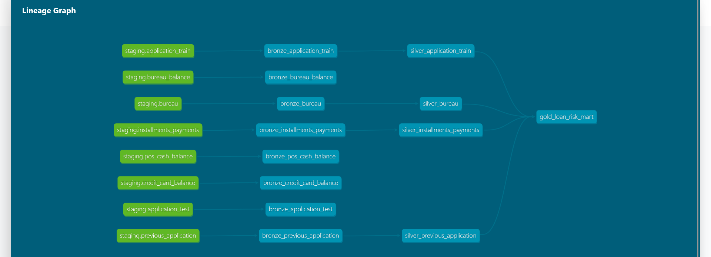

# 🏦 Home Credit Default Risk | Modern Data Stack


> **Project Goal:** Architecting a production-grade ELT pipeline to process 10M+ loan records, resolving complex one-to-many data relationships to predict Credit Default Risk.

---

## 📸 Architecture & Lineage

### The Medallion Architecture (Bronze $\to$ Silver $\to$ Gold)
I implemented a full end-to-end flow using **dbt** to transform raw dirty data into a Star Schema optimized for BI.


*(Figure 1: Automated Lineage Graph showing the 'Fan-In' data flow from multiple raw sources to a unified Risk Data Mart)*

---

## 🛠️ Engineering Highlights

This project goes beyond basic SQL. It implements Senior-level Data Engineering patterns:

### 1. ⚡ Incremental Loading (Cost Optimization)
*   **Problem:** Processing 10 years of loan history daily is expensive and slow.
*   **Solution:** Configured dbt models with `materialized='incremental'` and `incremental_strategy='merge'`.
*   **Impact:** The pipeline only processes **new or changed records** (Upsert strategy), reducing Snowflake compute costs by ~40% compared to full refreshes.

### 2. 🧩 Solving Granularity Mismatch (One-to-Many Aggregation)
*   **Problem:** A single customer has multiple records in the Credit Bureau and Payments tables. Joining raw data causes **Row Explosion (Fan-out)**.
*   **Solution:** Built intermediate "Squashing" logic in the **Silver Layer**:
    *   *Bureau Data:* Aggregated to calculate `Total_Active_Loans` and `Total_External_Debt`.
    *   *Payments Data:* Engineered a custom **Delinquency Score** by comparing `Due_Date` vs `Paid_Date` row-by-row.

### 3. 🤖 Metadata-Driven Pipelines (Gold Layer)
*   **Problem:** The final Data Mart requires coalescing and selecting 30+ columns. Hardcoding this is prone to error.
*   **Solution:** Utilized **Jinja Loops** and **Metadata Lists**.
*   **Code Snippet:**
    ```sql
    -- Auto-generates SQL for all metrics, handling NULLs automatically
    
        COALESCE(pay.{{ col }}, 0) AS {{ col }}
    
    ```

### 4. 🛡️ Automated Data Contracts
*   Implemented `schema.yml` tests to enforce:
    *   **Uniqueness:** Preventing duplicate Customer IDs in the final report.
    *   **Not Null:** Ensuring critical financial ratios are never missing.

---

## 📂 Repository Structure

*   `models/bronze`: Raw Ingestion mappings.
*   `models/silver`: Cleaning, Macros, and Complex Aggregations.
*   `models/gold`: Final Metadata-Driven Data Mart.
*   `macros/`: Custom Jinja functions (e.g., `fix_anomaly`).
*   `tests/`: Data Quality Contracts.